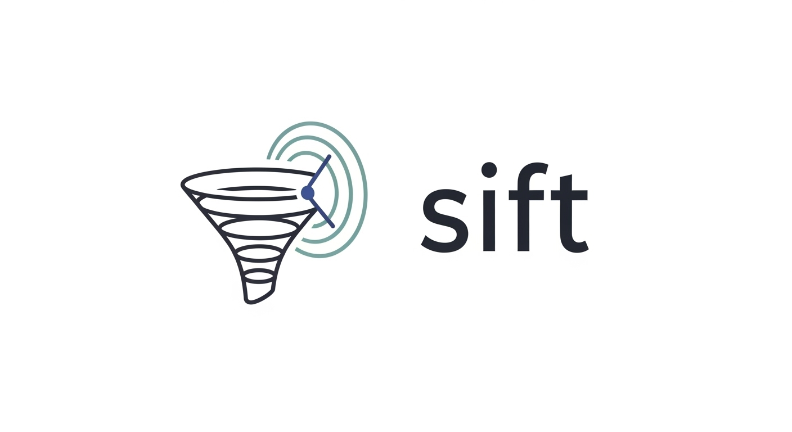

# Sift



Sift is a Flask project I built to explore how digital forensics and OSINT can be reviewed side by side. The main idea is simple: load filesystem timeline data from an image, collect public-facing context, and look for overlaps in time, location, and keywords.

This is still a personal project, so I kept the stack local and fairly plain:

- Flask for the UI
- SQLite for storage
- `pytsk3` for image parsing
- optional OSINT/API integrations
- optional local LLM support through Ollama

## What it does

- Creates and tracks investigations
- Parses E01 and raw-style evidence images into forensic timeline events
- Pulls Reddit, Twitter/X, news, and web search results when credentials are available
- Scores correlations between forensic events and public data
- Shows the results in timeline, map, and analytics views

## Quick Start

The easiest path on this repo is micromamba:

```bash
micromamba create -f environment.yml
micromamba activate sift
cp .env.example .env
python src/webapp.py
```

Then open `http://127.0.0.1:5000`.

If you do not want the LLM and web-search pieces while testing the UI, set these in `.env` first:

```env
OLLAMA_ENABLE=False
WEB_SEARCH_ENABLE=False
```

## Notes

- Evidence parsing depends on `pytsk3`. If that package gives you trouble on your machine, see [docs/SETUP_DEPENDENCIES.md](/home/nathan/Repos/Sift/docs/SETUP_DEPENDENCIES.md).
- API keys are optional. The app will still run without them, but collection features will be limited.
- The project currently assumes local use and does not include auth or multi-user access control.

## Project Layout

- [src/](/home/nathan/Repos/Sift/src) application code
- [templates/](/home/nathan/Repos/Sift/templates) Flask templates
- [docs/SETUP_DEPENDENCIES.md](/home/nathan/Repos/Sift/docs/SETUP_DEPENDENCIES.md) setup notes and dependency caveats

