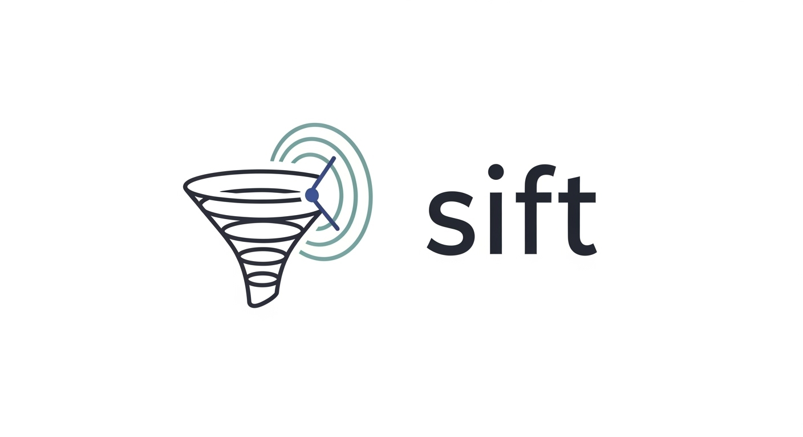

**Forensic Intelligence Correlation Platform**

Sift bridges the gap between digital forensic analysis and open-source intelligence (OSINT) by correlating temporal, spatial, and content patterns between forensic evidence and publicly available data. Built for investigators who need enhanced situational awareness and contextual intelligence.

## Features

### Core Capabilities
- **Digital Forensic Analysis** - Process E01, DD, RAW, and IMG disk images
- **Multi-Source OSINT Collection** - Twitter, Reddit, News APIs, and web intelligence
- **LLM-Powered Analysis** - Local Ollama integration for privacy-preserving insights
- **Advanced Correlation Engine** - Temporal, spatial, and content-based correlation algorithms
- **Interactive Web Interface** - Complete investigation management with visualizations
- **Intelligent Web Search** - Context-aware search query generation using forensic evidence

### Privacy & Security
- **Local Processing** - All sensitive data remains on your infrastructure
- **No Cloud Dependencies** - LLM analysis performed locally via Ollama
- **Secure Configuration** - Environment-based configuration management
- **Data Integrity** - Comprehensive database relationships with cascading operations

## Quick Start

### Installation

1. **Clone Repository**
   ```bash
   git clone https://github.com/Nathan-Luevano/Sift.git
   cd Sift
   ```

2. **Setup Environment**
   ```bash
   python -m venv venv
   source venv/bin/activate  # On Windows: venv\Scripts\activate
   pip install -r requirements.txt
   ```

3. **Install Ollama** (for LLM capabilities)
   ```bash
   curl -fsSL https://ollama.ai/install.sh | sh
   ollama serve
   ollama pull gemma:7b  # Recommended starting model
   ```

4. **Configure Environment**
   ```bash
   cp .env.example .env
   # Edit .env with your API keys and configuration
   ```

5. **Start Application**
   ```bash
   cd src
   python webapp.py
   ```

6. **Access Web Interface**
   ```
   http://localhost:5000
   ```

### First Investigation

1. **Create Investigation** - Define scope, location, and timeframe
2. **Upload Evidence** - Process disk images for forensic timeline extraction
3. **Collect OSINT** - Gather intelligence from multiple public sources
4. **Run Correlation** - Execute multi-dimensional correlation analysis
5. **Analyze Results** - Review correlations, timeline, and LLM insights

## System Requirements

### Minimum Requirements
- Python 3.8+
- 4GB RAM
- 10GB disk space
- Modern web browser

### Recommended for LLM Analysis
- 16GB+ RAM
- Ollama with 7B+ parameter model
- SSD storage for better performance

## Configuration

Sift uses environment variables for all configuration. Key settings include:

- **Database**: `DATABASE_PATH`
- **OSINT APIs**: `TWITTER_*`, `REDDIT_*`, `NEWS_API_KEY`
- **Web Search**: `GOOGLE_API_KEY`, `GOOGLE_CSE_ID`, `SERPAPI_KEY`
- **LLM**: `OLLAMA_HOST`, `OLLAMA_MODEL`
- **Web Server**: `FLASK_HOST`, `FLASK_PORT`, `FLASK_DEBUG`

See `.env.example` for complete configuration options.

## Architecture

### Core Components
- **Web Interface** - Flask-based investigation management
- **Database Layer** - SQLite with comprehensive schema
- **Forensic Engine** - pytsk3-based disk image analysis
- **OSINT Collector** - Multi-source intelligence gathering
- **Correlation Engine** - Advanced pattern matching algorithms
- **LLM Integration** - Local Ollama model management
- **Web Intelligence** - Context-aware search and content extraction

### Data Flow
1. Forensic evidence processing creates timeline events
2. OSINT collection gathers relevant public intelligence  
3. Correlation engine identifies relationships between datasets
4. LLM analysis provides contextual insights and patterns
5. Web interface presents results through multiple visualization modes

## Use Cases

### Digital Forensics
- **Timeline Analysis** - Correlate filesystem events with external intelligence
- **Context Enhancement** - Add situational awareness to forensic findings
- **Pattern Recognition** - Identify relationships across data sources

### Threat Intelligence
- **Attribution Analysis** - Connect forensic artifacts to public intelligence
- **Campaign Tracking** - Monitor threat actor activities across sources
- **IOC Enrichment** - Enhance indicators with contextual information

### Incident Response
- **Situational Awareness** - Understand broader context of security incidents
- **Intelligence Fusion** - Combine internal forensics with external intelligence
- **Timeline Reconstruction** - Build comprehensive incident timelines

## Documentation

- **[Technical Documentation](docs/TECHNICAL_DOCUMENTATION.md)** - Comprehensive architecture and implementation details
- **[Setup Dependencies](docs/SETUP_DEPENDENCIES.md)** - Additional setup and dependency information


## Support

- **Issues** - Report bugs and feature requests via GitHub Issues
- **Discussions** - Join community discussions for questions and ideas
- **Security** - Report security vulnerabilities privately to security@sift-project.org

## Acknowledgments

Sift builds upon excellent open-source projects including:

- **[pytsk3](https://github.com/py4n6/pytsk)** - Digital forensics library
- **[Ollama](https://ollama.ai/)** - Local LLM inference platform
- **[Flask](https://flask.palletsprojects.com/)** - Web application framework
- **[Plotly](https://plotly.com/python/)** - Interactive visualization library

---

**Built for investigators, by an investigator.**